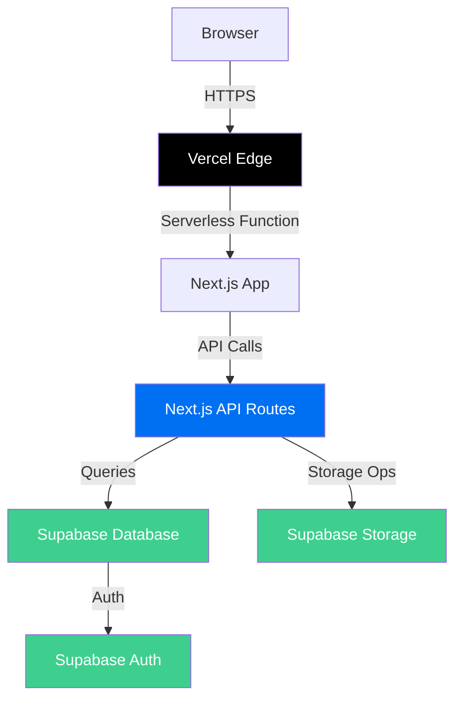

# Production Readiness Assessment

## Executive Summary

**Status: NOT READY FOR PRODUCTION** ⚠️

Your Clipshare application has a solid foundation with good practices in authentication, input validation, and database security. However, there are **critical security and deployment issues** that must be addressed before going live.

---

## Current Architecture

```
┌─────────────┐     ┌─────────────┐     ┌─────────────┐
│   Browser   │────▶│  Next.js    │────▶│   Fastify   │
│  (Recording)│     │  Frontend  │     │     API     │
└─────────────┘     └──────┬──────┘     └──────┬──────┘
                           │                   │
                           ▼                   ▼
                    ┌─────────────┐     ┌─────────────┐
                    │  Supabase   │     │  Supabase   │
                    │   Storage   │     │  Database   │
                    └─────────────┘     └─────────────┘
```

**Tech Stack:**
- Frontend: Next.js 15 (App Router) with standalone output
- Backend: Fastify API server (requires migration for serverless)
- Auth/Database/Storage: Supabase (managed service)
- Deployment target: Vercel/Serverless

---

## ✅ What's Done Well

| Category | Implementation | Status |
|----------|----------------|--------|
| Authentication | Email magic link via Supabase Auth | ✅ Good |
| Cookie Security | `httpOnly: true`, `secure: true` in production | ✅ Good |
| Input Validation | Zod schemas on all API routes | ✅ Good |
| Database Security | Prisma ORM with RLS policies | ✅ Good |
| Storage Security | Presigned URLs (no direct bucket access) | ✅ Good |
| SQL Injection | Parameterized queries via Prisma | ✅ Good |
| HTTP Headers | X-Content-Type-Options, X-Frame-Options, X-XSS-Protection | ✅ Good |
| Docker Security | Non-root user in Dockerfile | ✅ Good |

---

## ❌ Critical Issues

### Phase 1: Security (Must Fix)

| Priority | Issue | Location | Risk |
|----------|-------|----------|------|
| 🔴 Critical | **No Rate Limiting** | API server | Brute force attacks on auth |
| 🔴 Critical | **No CSRF Protection** | All POST/PUT/DELETE | Cross-site request forgery |
| 🔴 Critical | **Session Valid 30 Days** | [`apps/api/src/routes/auth.ts:58`](apps/api/src/routes/auth.ts:58) | Long-lived sessions without refresh |
| 🔴 Critical | **API Not Serverless-Ready** | [`apps/api/`](apps/api/) | Cannot deploy to Vercel |
| 🟠 High | **No Request Size Limits** | [`apps/api/src/index.ts`](apps/api/src/index.ts) | DoS attacks |
| 🟠 High | **No HSTS Header** | [`apps/web/next.config.js`](apps/web/next.config.js) | Man-in-the-middle |
| 🟠 High | **No Content-Security-Policy** | [`apps/web/next.config.js`](apps/web/next.config.js) | XSS attacks |
| 🟡 Medium | **No Production Env File** | [`apps/api/`](apps/api/) | Misconfiguration risk |
| 🟡 Medium | **Magic Link Logged to Console** | [`apps/api/src/routes/auth.ts:24`](apps/api/src/routes/auth.ts:24) | Information disclosure |

---

### Phase 2: Deployment (Must Fix for Serverless)

| Priority | Issue | Location | Impact |
|----------|-------|----------|--------|
| 🔴 Critical | **Fastify API Cannot Deploy to Vercel** | [`apps/api/`](apps/api/) | Must convert to Next.js API routes |
| 🔴 Critical | **No API Routes for Frontend** | [`apps/web/src/app/api/`](apps/web/src/app/api/) | All API calls will fail |
| 🟠 High | **Missing Vercel Config** | Root directory | No deployment configuration |
| 🟠 High | **CORS Not Production-Ready** | [`apps/api/src/index.ts:15`](apps/api/src/index.ts:15) | Defaults to localhost |

---

## Recommended Action Plan

### Step 1: Migrate API to Next.js API Routes

Convert Fastify routes to Next.js API routes for Vercel compatibility:

```
Current:                         Target:
apps/api/src/routes/auth.ts  →  apps/web/src/app/api/auth/[...path]/route.ts
apps/api/src/routes/recordings.ts
apps/api/src/routes/upload.ts
apps/api/src/routes/share.ts
```

### Step 2: Add Security Hardening

1. **Rate Limiting** - Use Vercel's built-in rate limiting or `@upstash/ratelimit`
2. **CSRF Protection** - Implement Next.js CSRF tokens
3. **Session Security** - Reduce cookie maxAge, implement refresh mechanism
4. **Headers** - Add HSTS and CSP in `next.config.js`

### Step 3: Create Production Environment

1. Create [`apps/web/.env.production`](apps/web/.env.production) (already exists, needs values)
2. Create production Supabase project (if not already done)
3. Configure custom domain and SSL

### Step 4: Verify and Test

1. Run production build: `pnpm build`
2. Test all authentication flows
3. Test video upload and sharing
4. Verify security headers

---

## Mermaid: Recommended Deployment Architecture



---

## Files Requiring Changes

### New Files to Create
| File | Purpose |
|------|---------|
| `apps/web/src/app/api/auth/route.ts` | Auth API endpoint |
| `apps/web/src/app/api/recordings/route.ts` | Recordings API endpoint |
| `apps/web/src/app/api/upload/route.ts` | Upload API endpoint |
| `apps/web/src/app/api/share/route.ts` | Share API endpoint |
| `vercel.json` | Vercel configuration |

### Files to Modify
| File | Changes |
|------|---------|
| [`apps/web/next.config.js`](apps/web/next.config.js) | Add HSTS, CSP headers |
| [`apps/web/package.json`](apps/web/package.json) | Add API route dependencies |

### Files to Review
| File | Action |
|------|--------|
| [`apps/api/`](apps/api/) | Keep for local dev or deprecate |
| [`.env`](.env) | Rotate secrets before production |

---

## Pre-Launch Checklist

- [ ] Convert Fastify API to Next.js API routes
- [ ] Configure Vercel project and deployment
- [ ] Set up production Supabase project
- [ ] Configure custom domain with SSL
- [ ] Add rate limiting (Vercel or middleware)
- [ ] Add CSRF protection
- [ ] Add HSTS header
- [ ] Add Content-Security-Policy
- [ ] Reduce session cookie duration
- [ ] Create production environment variables
- [ ] Test all authentication flows
- [ ] Test video upload flow
- [ ] Test sharing functionality
- [ ] Rotate all secrets and keys
- [ ] Set up monitoring (Vercel Analytics)
- [ ] Configure error tracking (Sentry)

---

## Questions for Clarification

1. **Do you have a production Supabase project ready?**
2. **Do you want to keep the Fastify API separate or migrate entirely to Next.js API routes?**
3. **What's your timeline for addressing these issues?**

---

*Assessment created: 2026-03-06*
*Mode: Architect*
